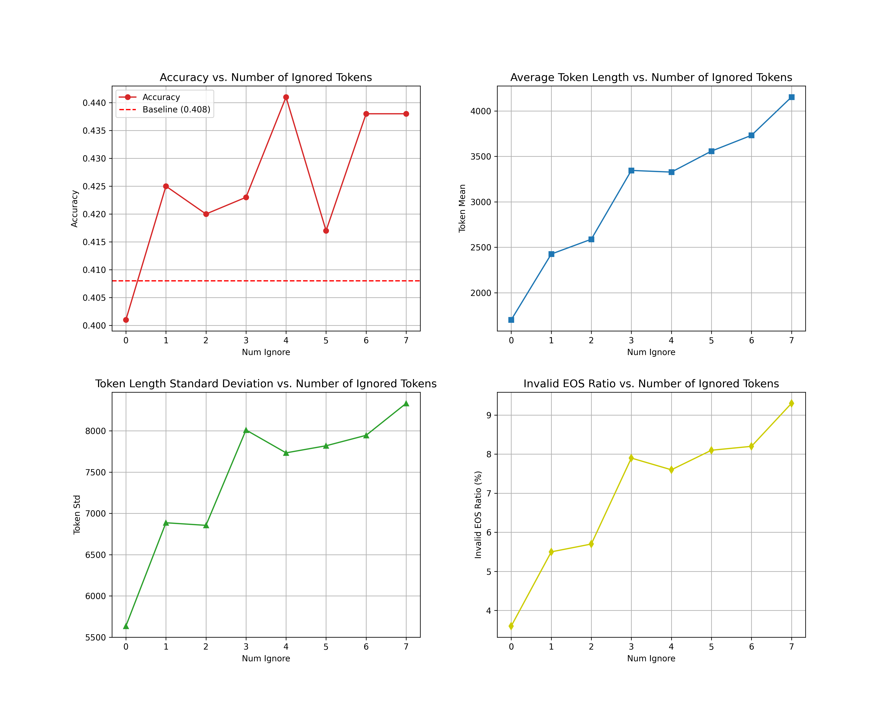

<h1 align="center">S1-M: Simple Test-time Scaling in Multimodal Reasoning </h1>

[🤗 S1-M-7B Model (Beta)](https://huggingface.co/PKU-Alignment/s1-m_7b_beta) | [🤗 S1-M Dataset (Beta)](https://huggingface.co/datasets/PKU-Alignment/s1-m_beta)

**Technical report coming as soon as possible**

## Insights and Future Plans

We fine-tuned the Qwen2-VL-7B model on the S1-M Dataset (Beta) to construct the S1-M-7B (Beta) model, which is equipped with chain-of-thought reasoning capabilities. Additionally, we explored the Test-time Scaling Law for multi-modal reasoning within the multi-modal domain.

By introducing an Ignore Token mechanism during the inference phase, we effectively increased the computational load of the model (characterized by an increase in the number of generated tokens). Our experiments revealed a positive correlation between this computational expansion and the model's performance on the MathVista benchmark (as shown in the figure below). The complete evaluation data has been open-sourced and is available in the directory: `evaluation-test_time_scaling_law/MathVista/evaluation_results`.



The current experiments are constrained by a technical bottleneck related to the abnormal generation of the End-of-Sequence (EOS) token, resulting in approximately 9% of test samples being lost due to difficulties in correctly parsing the model's output. This issue is likely the primary reason why performance does not continue to improve when the number of ignored tokens becomes large. Future work will focus on optimizing the decoding termination mechanism to further validate the Test-time Scaling Law for multi-modal large models.

On the other hand, an analysis of the data distribution suggests that the training dataset lacks problems requiring extended reasoning. For instance, even math-related problems from S1-M can typically be answered with around 1,000 tokens of reasoning. In contrast, the average response length in S1.1 reaches approximately 9,872 tokens. This discrepancy makes it challenging for the model to engage in reasoning spanning thousands of tokens when using the budget-forcing algorithm to mandate extended thinking.


The issue of insufficient reasoning length in the training data is also prevalent in the multi-modal reasoning datasets available in the open-source community. In our future work, we plan to address this by creating multi-modal datasets that involve longer reasoning processes.


**Additional Notes:** The current evaluation results for Qwen2VL-7B show significant discrepancies compared to the official technical report. Notably, our self-developed evaluation script successfully reproduced the benchmark performance of Qwen2VL-72B as reported in the technical report (see details in `evaluation-test_time_scaling_law/MathVista/evaluation_results`). However, the reproduction process for Qwen2VL-7B did not go as smoothly. We will conduct a systematic investigation to identify the root causes and update the baseline model's evaluation results accordingly. To promote research reproducibility, we have open-sourced the complete evaluation pipeline and raw data at the aforementioned path.

## Easy Installation
```bash
# clone the repository
git clone git@github.com:PKU-Alignment/s1-m.git
cd s1-m

# create virtual env
conda create -n s1-m python==3.11
conda activate s1-m
```

- `[Optional]` We recommend installing CUDA in the conda environment and set the environment variable.

```bash
# We tested on the H800 computing cluster, and this version of CUDA works well.
# You can adjust this version according to the actual situation of the computing cluster.

conda install nvidia/label/cuda-12.2.0::cuda
export CUDA_HOME=$CONDA_PREFIX
```

> If your CUDA installed in a different location, such as `/usr/local/cuda/bin/nvcc`, you can set the environment variables as follows:

```bash
export CUDA_HOME="/usr/local/cuda"
```

Finally, install `s1-m` by:

```bash
# We prepare quick installation for training and evaluation.
# If you only need to use the training or evaluation module,
# you can install the corresponding dependencies.
pip install -e .[train] # install the training dependencies
pip install -e .[evaluate] # install the evaluation dependencies

# If you need to install all dependencies, you can use the following command:
pip install -e .[all]
```

## Training Models

### Quickstart
We provide some scripts for quick start, you can find them in the `./scripts` directory. These scripts would automatically download the model and dataset, and run the training
```bash
cd scripts
bash qwen2vl_sft.sh
```

### Details

The model training implementation is based on functional extensions to the align-anything repository ([commit c45c457](https://github.com/PKU-Alignment/align-anything/tree/c45c4573b1ec495bfe5e1f00cbb78c97b8ae2447)). The primary modification involves integrating the loading of S1-M Dataset (Beta), while the rest of the architecture remains consistent with the original repository implementation. For environment setup, please refer to the [original repository](https://github.com/PKU-Alignment/align-anything).

To initiate training, it is recommended to execute the `scripts/qwen2vl_sft.sh` script to start the S1-M-7B (Beta) fine-tuning process (for detailed parameter configurations, see the comments in the script). Users operating on SLURM clusters are advised to refer to the distributed training configuration solutions provided in the latest version of align-anything.

The recommended hardware configuration includes 8×A/H-series GPUs, with `batch_size=1` to avoid out-of-memory (OOM) issues. This configuration has been experimentally validated to reliably complete the fine-tuning of the 7B model.

## Evaluating models

### Quickstart

```bash
cd scripts
bash deploy.sh
# create new session
bash eval_math_vista.sh
```

### Details
To address the unique requirements of the Test-time Scaling Law evaluation paradigm, we have developed a dedicated evaluation script for Test-time Scaling Law (code path: `evaluation-test_time_scaling_law`). The current open-source version includes a complete implementation for the MathVista benchmark (with algorithm logic compatible with the official MathVista repository). Evaluation scripts for other benchmarks will be released in subsequent iterations.

The core algorithm, `budget_forcing` (path: `evaluation-test_time_scaling_law/MathVista/budget_forcing.py`), is adapted from the inference code of *s1: Simple test-time scaling*. It incorporates a multi-threading concurrency mechanism to optimize vLLM inference efficiency. In our experiments, the vLLM backend was deployed on a 4×H800 GPU cluster, achieving an inference speed of 1,600 tokens/s for S1-M-7B (Beta). Under ideal conditions (i.e., without abnormal EOS token generation), the full set of 1,000 samples in MathVista could be processed in approximately 3 minutes.

Evaluation Execution Workflow:

1. **Model Deployment**: Run `scripts/deploy.sh` to initialize the inference service.
2. **API Configuration**: Set the OpenAI API key and API base URL in `evaluation-test_time_scaling_law/MathVista/gpt4.py`.
3. **Distributed Evaluation**: Create a new session and execute `scripts/eval_math_vista.sh` (the default model is assumed to be deployed locally). For cross-node evaluations, specify the node IP address.

```bash
set -x

SCRIPT_DIR="$( cd "$( dirname "${BASH_SOURCE[0]}" )" && pwd )"
cd "${SCRIPT_DIR}/../evaluation-test_time_scaling_law/MathVista" || exit 1

python eval.py --api_base 'http://<node_ip>:8000/v1/chat/completions'
```